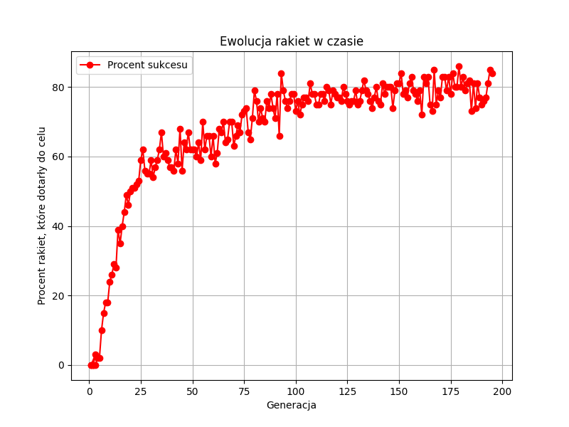

# Smart Rockets - Genetic Algorithm Simulation

[](https://www.rust-lang.org)
[](https://ggez.rs)

Symulacja rakiet uczących się omijać przeszkody za pomocą algorytmu genetycznego z możliwością rysowania ścian w czasie rzeczywistym.
Plik config zawiera wszystkie stałe używane w symulacji, pozwalając na łatwą modyfikację parametrów bez konieczności przeszukiwania całego kodu.



## Cechy projektu
- 🚀 Generacje rakiet ewoluujących w czasie rzeczywistym
- 🧬 Algorytm genetyczny z selekcją, krzyżowaniem i mutacją
- 🖌️ Interaktywne rysowanie ścian podczas symulacji
- 📊 Zapis danych generacji do pliku CSV
- 🏎️ Optymalizacje wydajnościowe (wielowątkowość, batch rendering)

## Instalacja
1. Zainstaluj zależności systemowe:
```bash
# Ubuntu/Debian
sudo apt install libsdl2-dev libasound2-dev

# Windows: Zainstaluj SDL2 z https://github.com/libsdl-org/SDL/releases

# MacOS: Zainstaluj SDL2 z https://formulae.brew.sh/formula/sdl2
```
2. Sklonuj repozytorium:
```bash
git clone https://github.com/mrdziuban/smart-rockets.git
cd smart-rockets
```


## Uruchomienie
```bash
cargo run --release
```

```
python watch.py
```

## Licencja
[MIT](LICENSE)
